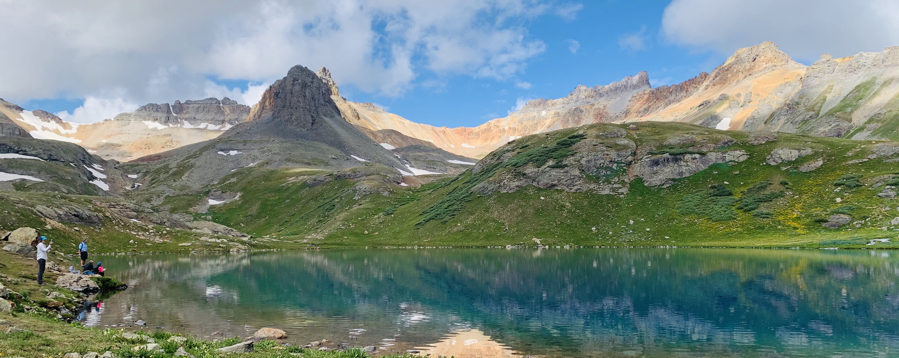
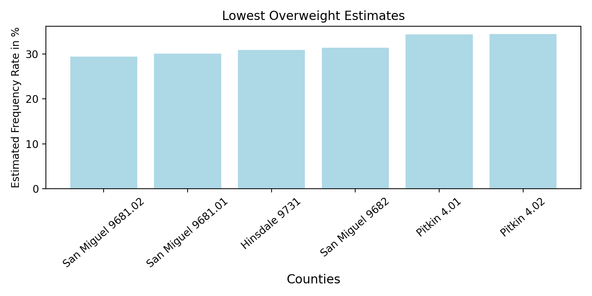
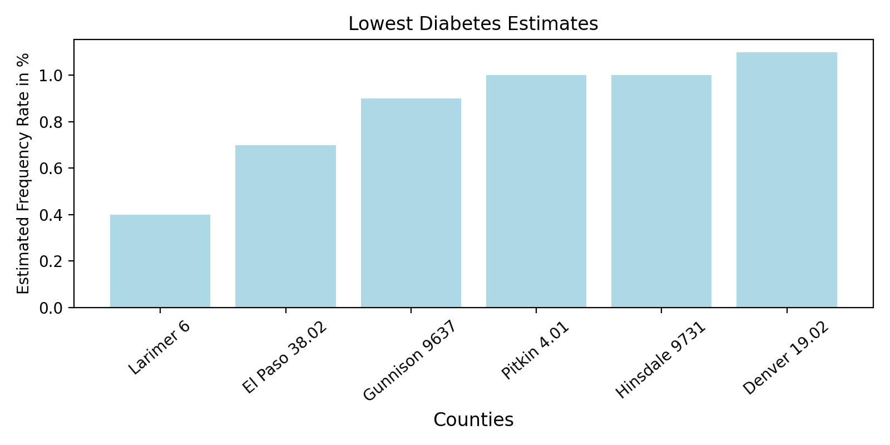
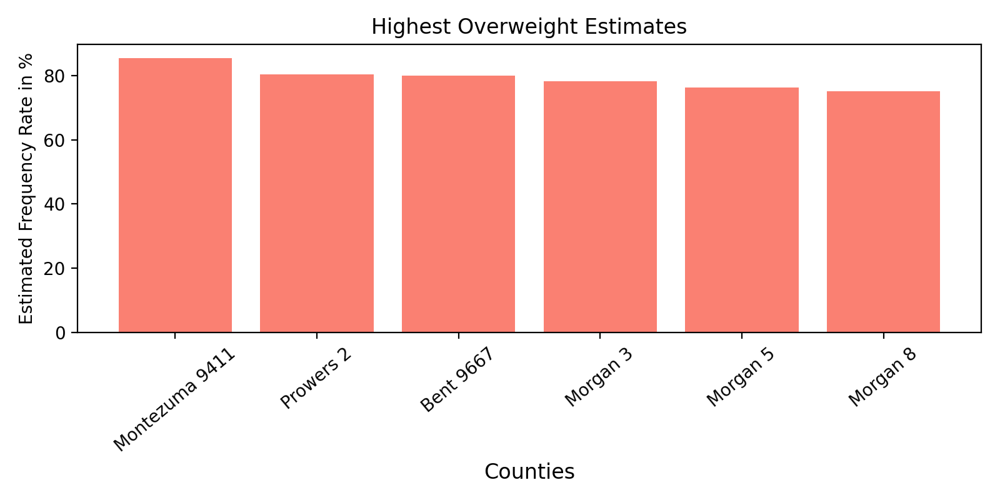
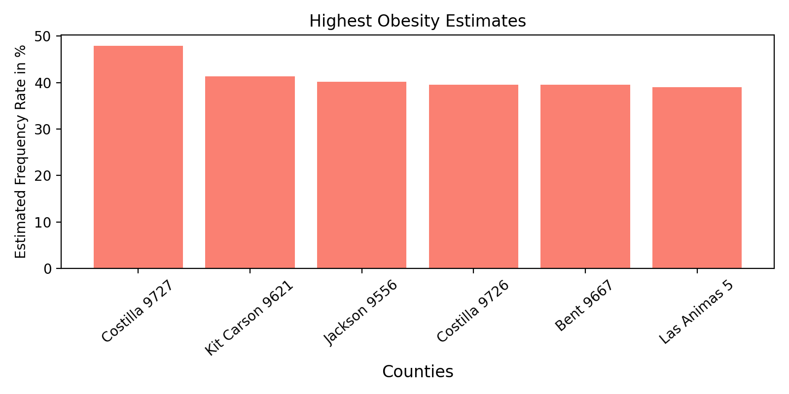
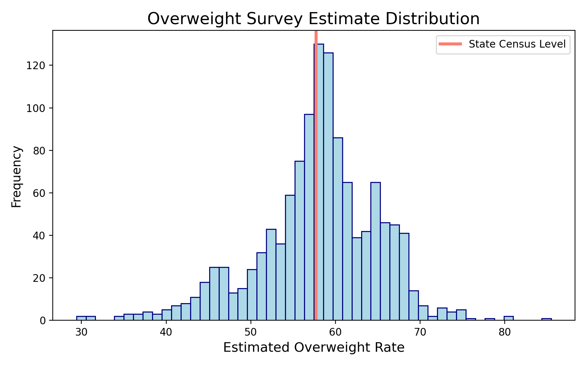

<H1> Fit or Faux: A look into Colorado’s Health Data</H1>

# Background & Motivation

Health has been a growing passion of mine. Living in Colorado there is an abundance of indoor and outdoor activities to partake in and get you moving. Many social interactions even take place around some form of activity or movement. An article written in 2020, published on Exercise.com - “These are the 10 fittest states in America” dubbed Colorado number one. However, with numerous health epidemics on the rise, including obesity I want to know how healthy is the state truly? Is Colorado performing up to the standard to combat these epidemics or could there be room for improvement? By creating additional awareness to these epidemics hopefully it will encourage individuals to make better decisions that will impact their health positively. 

# Data
Colorado Department of Public Health & Environment released Community Level Estimates for 18 data sets specific to health conditions and risk behaviors. Some data sets are include Overweight, Obese, Diabetes, Binge Drinking, Asthma, etc. Individual survey responses from the Colorado Behaioral Risk Factor Surveillance System (BRFSS) are nested within geographic boundaries (counties) where both individual characteristics (demographic) as well as sociodemographic characteristics can be used to model the the probability of having a condition or risk behavior. 

The BRFSS originally began in 1984 and typically run by the Center for Disease Control and Prevention (CDC) although individual States can and do conduct their own surveys with the ability to add to the general questionnaire. The survey is conducted by random over the phone. Public and private health authorities a tthe federal, state and local levels use BRFSS data to identify public health problems, design policies and interventions, set goals and measure progress toward these goals. 

# Exploratory Data Analysis
From the 18 data sets provided I decided to look at the following: Diabetes, Obesity, and Overweight. The CDPHE isolated 64 counties into roughly 1,240 rows with 16 standard columns. Each row is unique with its own Census Tract data. This data provides insight on the County name, adult population over 18 (within that census tract data), health condition or risk behavior estimate, estimate confidence interval, quintile, health condition or risk behavior county regional estimate, and state estimate. 

It is worth noting the relationship between body mass index (BMI) and overweight/obesity. BMI is measured as the ratio of health to weight. BMI often correlates with important health outcomes like heart disease, diabetes, cancer, and overall mortality. For adult men and woman a "healthy" BMI is between 18.5% and 24.9%. An overweight BMI is considered between 25.00% to 29.9%. Lastly, an obese BMI is 30.0% and above.

Although the data was fairly clean there were 18 null values within Overweight and Diabetes and 36 null values for Obesity. CDPHE stated for counties less than 50 people residing data would not be available which may be attribute to the missing data. In order to reduce graphing errors I also created an additional column to distibguish the census tract id and country name.

Upon cleaning the missing data values I wanted to get a feel for the data. First, I wanted to inspect our sample sizes for the cenesus tracts. How I did this was looking at the column "Adult Population Over 18". As you can tell below, our sample sizes are very consistent among the data sets. This makes sense because the census tracts are based on surveys presented in the same geographical specific region. 

 

The median data for Adults over 18 was roughly 3,221. and the mean data for Adults over 18 was roughly 3,350. Which made curious as to groupings per county.

<groupings per county>

Further into exploratory analysis let's take a look at some data specific samples of the regions within counties most and least at risk for the health conditions.

The following graphs are census and counties with the lowest prevalence rates.

 

 
 

| County_Name   |   OverweightObese_Census_Tract_Estimate |
|:--------------|----------------------------------------:|
| Hinsdale      |                                 30.90   |
| San Miguel    |                                 31.73   |
| Pitkin        |                                 36.75   |
| Mineral       |                                 36.90   |
| Ouray         |                                 41.40   |
| Eagle         |                                 41.87   |

 

 

| County_Name   |   Obese_Census_Tract_Estimate |
|:--------------|------------------------------:|
| Mineral       |                           2.50|
| Hinsdale      |                           4.80|
| San Miguel    |                           5.30|
| Gunnison      |                           7.70|
| Pitkin        |                           9.30|
| Summit        |                          10.80|

| County_Name   |   Diabetes_Census_Tract_Estimate |
|:--------------|---------------------------------:|
| Hinsdale      |                          1.00    |
| San Juan      |                          1.10    |
| Mineral       |                          1.20    |
| Gunnison      |                          1.46    |
| Eagle         |                          1.83    |
| Pitkin        |                          1.90    |

 

 

 

| County_Name   |   OverweightObese_Census_Tract_Estimate |
|:--------------|----------------------------------------:|
| Bent          |                                  80.00  |
| Morgan        |                                  74.82  |
| Huerfano      |                                  72.65  |
| Kiowa         |                                  72.40  |
| Prowers       |                                  71.74  |
| Costilla      |                                  70.45  |
 

 

 

| County_Name   |   Obese_Census_Tract_Estimate |
|:--------------|------------------------------:|
| Costilla      |                         43.70 |
| Jackson       |                         40.20 |
| Bent          |                         39.50 |
| Kit Carson    |                         38.50 |
| Las Animas    |                         36.55 |
| Cheyenne      |                         35.60 |

 

| County_Name   |   Diabetes_Census_Tract_Estimate |
|:--------------|---------------------------------:|
| Prowers       |                          19.80   |
| Costilla      |                          17.90   |
| Saguache      |                          16.35   |
| Jackson       |                          16.30   |
| Kit Carson    |                          16.03   |
| Otero         |                          16.00   |

As one can tell there is can be quite a discrepancy so it would be benficial to see where these lay on a total distribution.

 

# Conclusions
While examining the data I am able to comment on Colorado's fitness level on a national scale via state by state. However, the CDC published estimates for 2017 estimated the percentage of adults 20 and over with obesity was 42.5% (compared to Colorado's average estimate of 21.6) and overweight inlcuding obesity was 73.6% (compared to Colorado's average estimates of 57.7%).

#

|       |   OverweightObese_Census_Tract_Estimate |
|:------|----------------------------------------:|
| count |                                 64.00   |
| mean  |                                 58.50   |
| std   |                                 10.67   |
| min   |                                 30.90   |
| 25%   |                                 52.52   |
| 50%   |                                 60.07   |
| 75%   |                                 66.15   |
| max   |                                 80.00   |

| Overweight Estimates  |                    Rates |
|:----------------------|-------------------------:|
| Counties > 57.7       |                      36  |
| Counties < 57.7       |                      28  |
| Counties > 73.6       |                       2  |
| Counites < 73.6       |                      62  |
# 

|       |   Obese_Census_Tract_Estimate |
|:------|------------------------------:|
| count |                      64.00    |
| mean  |                      22.85    |
| std   |                       9.19    |
| min   |                       2.50    |
| 25%   |                      17.14    |
| 50%   |                      23.10    |
| 75%   |                      28.67    |
| max   |                      43.70    |

| Obesity Estimates  |                       Rates |
|:-------------------|----------------------------:|
| Counties > 21.6    |                         37  |
| Counties < 21.6    |                         27  |
| Counties > 42.5    |                          1  |
| Counites < 42.5    |                         63  |
#

|       |   Diabetes_Census_Tract_Estimate |
|:------|---------------------------------:|
| count |                         64.00    |
| mean  |                          8.00    |
| std   |                          4.52    |
| min   |                          1.00    |
| 25%   |                          4.71    |
| 50%   |                          7.11    |
| 75%   |                         10.70    |
| max   |                         19.80    |

| Diabetes Estimates |                       Rates |
|:-------------------|----------------------------:|
| Counties > 7.0     |                         34  |
| Counties < 7.0     |                         30  |
| Counties > 10.5    |                         18  |
| Counites < 10.5    |                         46  |
#

So what does all of this data allude to? It would appear the the BRFSS surveys show that the mean of the data does align with the state estimates of the assesed health conditions. On a national scale, Colorado does have a considerably lower rate, but 

## Sources 
Data - 
[Colorado Department of Public Health & Environment - URL](http://www.cohealthmaps.dphe.state.co.us/cdphe_community_level_estimates/)

BMI Information - [Click Here](https://infogram.com/us-adult-obesity-rates-since-1960-1gzxop49on65mwy)

BRFSS - [CDPHE - BRFSS ](https://cdphe.colorado.gov/center-for-health-and-environmental-data/survey-research/behavioral-risk-factor-surveillance-system)

 CDC Obesity & Overweight Estimates [Click HEre](https://www.cdc.gov/nchs/fastats/obesity-overweight.htm)

